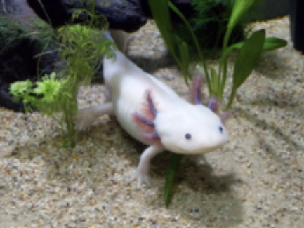

# Week 2 Lab Report

### Tyler Lee of the Axolotl Group
### A16976522


Note: This tutorial is for Windows Operating Systems.

## Installing VScode

Click on the following link.

[Visual Studio Code](https://code.visualstudio.com)

Click on the blue "Download for Windows" button and save the ".exe" file to your computer's "Downloads" folder.


Run the ".exe" file from your computer's "Downloads" folder and follow the given directions to install VS Code.

## Remotely Connecting

Install OpenSSH from the following link. Follow the instructions given on the site.

[OpenSSH](https://docs.microsoft.com/en-us/windows-server/administration/openssh/openssh_install_firstuse)

Click on the following link and type in your Username and your Student ID to find your CSE 15L account.

[Account](https://sdacs.ucsd.edu/~icc/index.php)


Open VS Code and simultaneously click "Ctrl + Shift + `" to open a new terminal. Then, type in the following command where the "xxx" is replaced by your special three characters at the end of your account name.

```
ssh cs15lsp22xxx@ieng6.ucsd.edu
```

Here is an example of what the input should look like.


If the terminal prompts for allowing IP access/trust, just accept the prompt (should just be typing "y" or "yes" and clicking "Enter").

The next prompt will request for a password but you will not see anything when you try entering something. That is fine. Enter your password and click "Enter". If it requests for the password again, it means your password was incorrect so just re-enter your password until it is accepted. Once you login, you should see something similar to the following block of text.


## Trying Some Commands

* cd : change directory
* cd .. : go up one directory
* cd ~ : return to home directory
* pwd : print working directory
* ls : list items in the current directory
* ls -a : list all items (including hidden items) in the current directory
* cp : copies a file to another location
* rm : remove a file
* cat : prints out the contents of a file

These are some general commands that are useful in many situations. However, more commands and their implementation can be found on many websites online. As an example, here is a link to one such site. 

[Link](https://www.comparitech.com/net-admin/powershell-cheat-sheet/)

Here are some examples of using a few of the commands.


## Moving Files with scp

scp : allows for copying files between your local computer and your remote CSE 15L account. This command isn't only used for this but in most cases for this course, this is what it will be used for since you may be transfering files between your local computer and the remote server.

To use the scp command, follow the template below.

```
scp <file-name> <directory>
```

## Setting an SSH Key

Copy and paste the following command.

```
ssh-keygen -t ed25519
```

At the next prompt, enter  the following text but replace the "user-name" with you computer's username.

```
/Users/<user-name>/.ssh/id_rsa
```

At the next prompt, do not add a passphrase. Just click enter without entering anything. Do the same thing when it asks for the same passphrase. The output should look similar to the following image.


Now you want to connect to your remote directory. Use the "ssh" command from before to log in.

```
ssh cs15lsp22xxx@ieng6.ucsd.edu
```

Enter your password to log in. Then type the following command.

```
mkdir .ssh
```

Now log out and return to your local directory. You can use "Ctrl + D" to log out. Type the following command and replace the "user-name" with your computer's username and replace the "xxx" with your unique three characters.

```
scp /Users/<user-name>/.ssh/id_rsa.pub cs15lsp22xxx@ieng6.ucsd.edu:~/.ssh/authorized_keys
```

Enter your password. You should receive an output similar to the following.


You should no longer be prompted for your password when logging into your remote directory.

## Optimizing Remote Running

To optimize running commands, you can combine commands in the same line. See the following examples.

```
ssh cs15lsp22xxx@ieng6.ucsd.edu "ls"
```

This command temporary logs you in and runs the "ls" command to see the files inside the remote directory. However, after this happens, you are sent back to your local directory (must be run from outside the remote directory).

See the following image for an example of what the command above does.


You can also use the up arrow key to use the last command used or cycle through the last few commands you have entered.

Semicolons can also be used to run multiple commands on the same line. See the following example.

```
cp <java-file-1> <java-file-2>; javac <java-file-2>; java <java-file-1>

```

Experimenting with running multiple commands on the same line is very useful to understand what is going on. Also, making sure the correct fuctions occur is very important.
