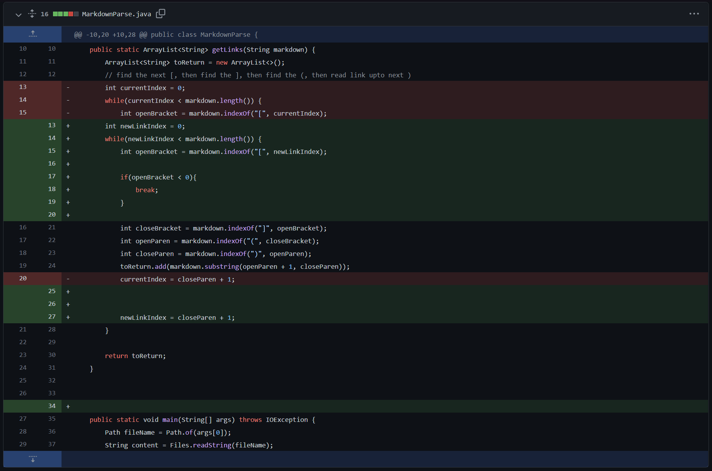
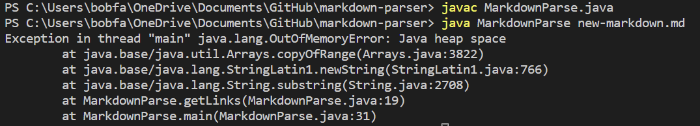
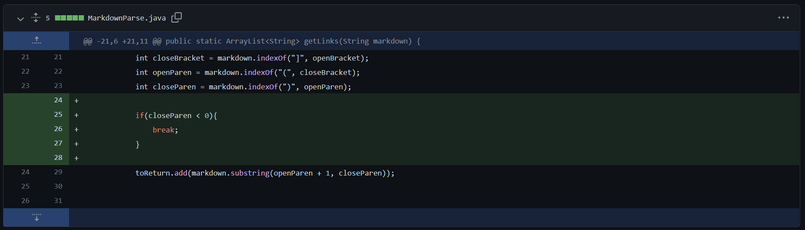
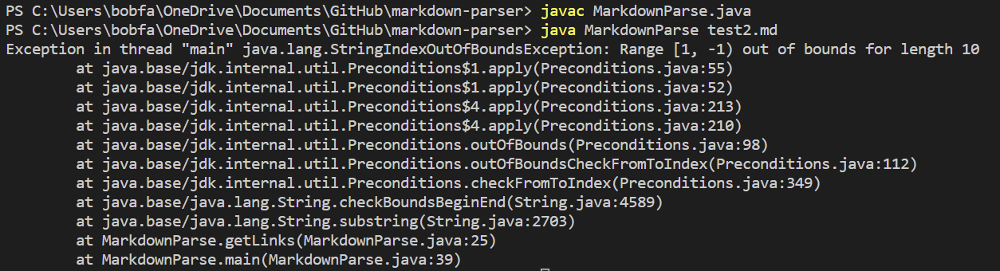
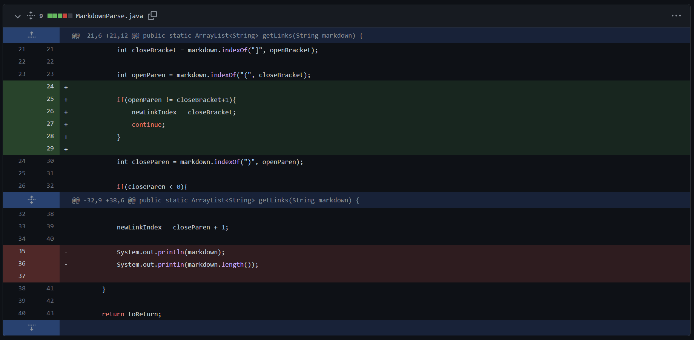
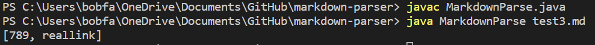

# Week 2 Lab Report

### Tyler Lee
### A16976522

## Test 1
### Screenshot of Code Change

### Link to Test File
[Test 1](https://github.com/tcl002/markdown-parser/blob/main/new-markdown.md)

### Symptom of Failed Test

### Bug, Symptoms, and Failure-Inducing Input
The failure-inducing input created an infinite loop which eventualy caused Java to run out of allocated memory on my laptop. In this case, the bug would be getting stuck in the infinite loop and the symptom is the eventual crash of the program due to the heap space becoming too large.

## Test 2
### Screenshot of Code Change

### Link to Test File
[Test 2](https://github.com/tcl002/markdown-parser/blob/main/test2.md)

### Symptom of Failed Test

### Bug, Symptoms, and Failure-Inducing Input
The failure-inducing input causes an index out of bounds exception since it is looking for a closing bracket but never finds one. In this case, the bug is the index out of bounds exception and the symptom is the program crashing because we are trying to search indexes out of bounds.

## Test 3
### Screenshot of Code Change

### Link to Test File
[Test 3](https://github.com/tcl002/markdown-parser/blob/main/test3.md)

### Symptom of Failed Test

### Bug, Symptoms, and Failure-Inducing Input
The failure-inducing input prints out two supposed links when only one should be printed out. In this case, the bug is that anything inside parentheses that comes after an opening and closing bracket is considered a link. Therefore, the symptom is the incorrect output that has two links when only one should be returned.
