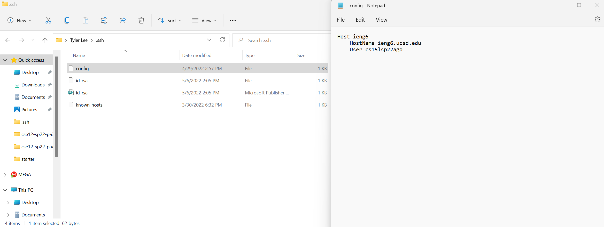
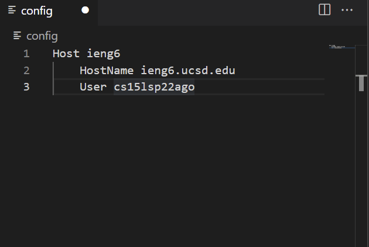
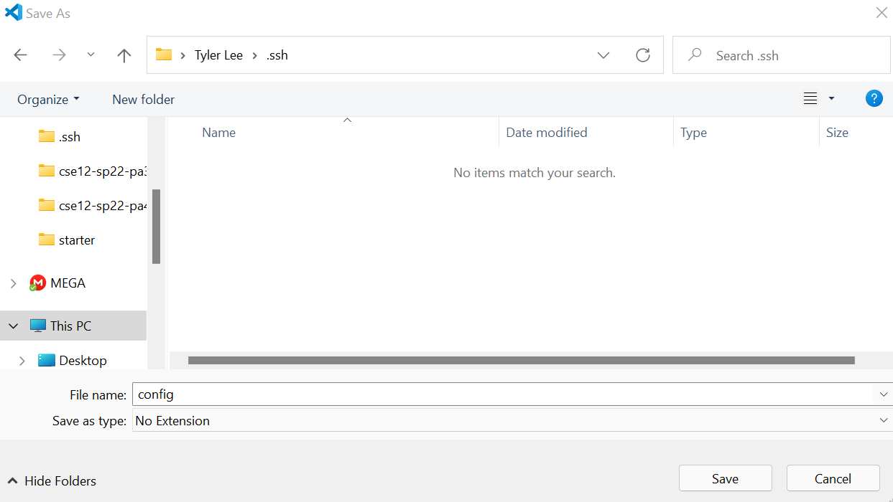

# Week 3 Lab Report

### Tyler Lee
### A16976522

## Streamlining ssh Configuration

I created the config file by creating a new file in VSCode and typing in the required text.

Then I saved the config file into my .ssh folder.

## Setup Github Access from ieng6

## Copy whole directories with `scp -r`