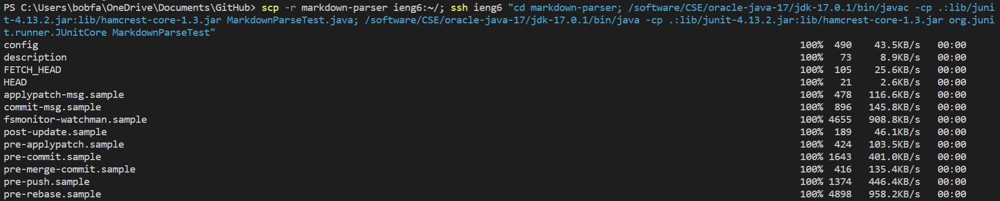
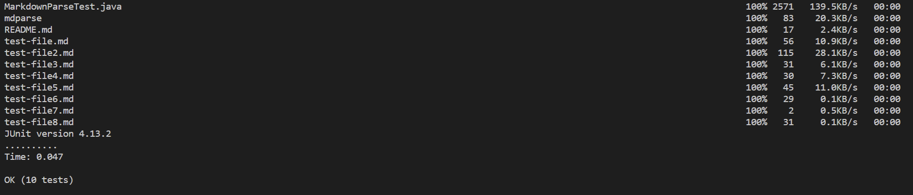

# Week 6 Lab Report 3

### Tyler Lee
### A16976522

## Streamlining ssh Configuration
Here is where my config file is saved and what it's contents look like.

I created the config file by creating a new file in VSCode and typing in the required text.

Then I saved the config file into my .ssh folder.

Here is an example of me using the `scp` command as well as the `ssh` command while using the alias shortcut.

## Setup Github Access from ieng6
Here is what my github SSH keys tab looks like with the keys from the remote server as well as my personal laptop.

This is where my key is stored on my remote server.

This is what happens when I log into the github account while I am on the remote server.

Here is an example of me committing and pushing.

Here is a link to the commit that was made above.
[Link to Commit](https://github.com/tcl002/cse15l-lab-reports/commit/a84e948940be1af2299dfe2963159215378c07c3)

## Copy whole directories with `scp -r`
Here is the output of using the `scp -r markdown-parser ieng6:~` command. Note that I skipped out some of the files being copied over because there were so many that I would need too many screenshots. I only screenshotted the beginning and end of the process.

Here is how I tested the files. I used the `javac` and `java` method for this because I forgot about the `make test` command.

Here is how I combined everything into one line. I used the `make test` command this time. Again, I only screenshotted the beginning and end of the command because there were so many files being copied over. The usual `javac` and `java` commands are replaced because the server is running on an older version of java.

