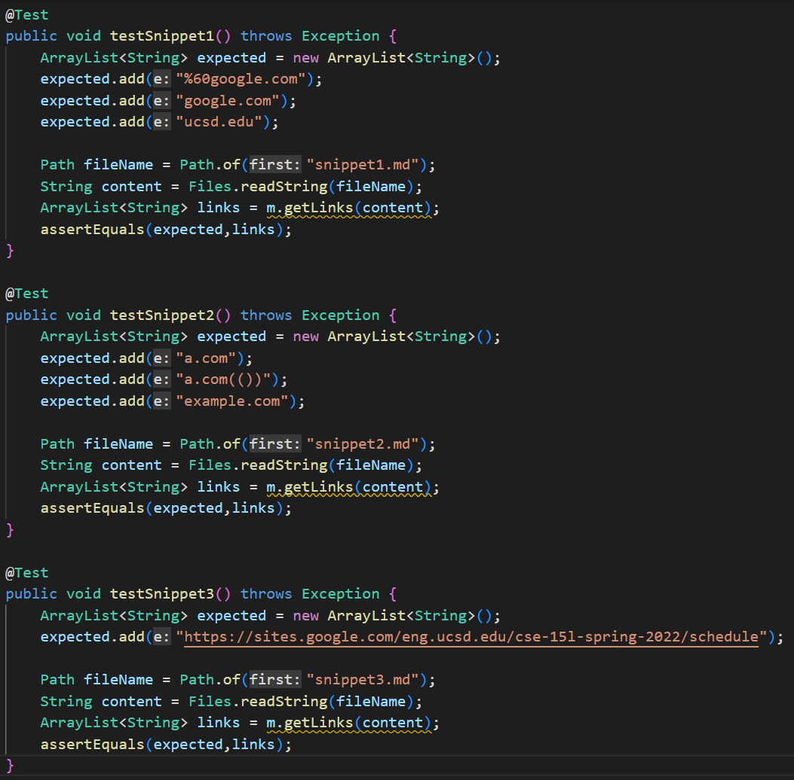
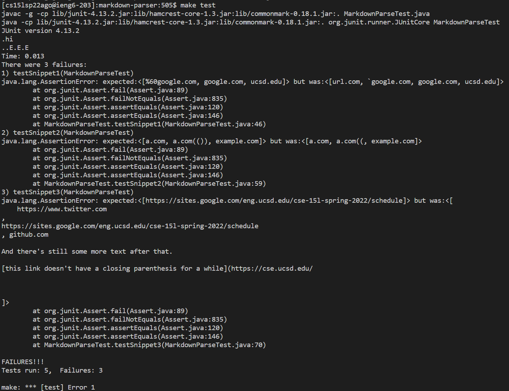

# Week 4 Lab Report

### Tyler Lee
### A16976522

## My Code
[Link to my Repository](https://github.com/dfigueroag/markdown-parser)
(note that this repository isn't owned by me but it is a group member's repository that I worked with in lab)

Here is the implementation of the tests that I added to my repository.

Here is the output after running my tests. All three tests failed.

## Their Implementation
[Link to their Repository](https://github.com/astoriama/markdown-parser)

Here is the implementation of the tests that I added to their repository.

Here is the output after running their tests. All three tests failed.

## Questions
### Snippet 1
For Snippet 1, I do not think there is a small change that will make my program work. The main issue is that the first expected link converts the extra `'` at the beginning into `%60`. Making conversions like this would probably take more than 10 lines as well as understanding how urls are created.

### Snippet 2
For Snippet 2, I do not think there is a small change that would fix the program. My reasoning for this is because, in the test output, even the expected website is incorrect even though I input the correct expected website in the actual test. This makes me believe that this is some inherent issue with either Java, the JUnit framework, or the way my test has been set up that would be a lot harder to fix than just altering the code.

### Snippet 3
For Snippet 3, I do think there is a small change that could fix this program. Right now, my code is essentially ignoring all white space but I could change it to only ignore the first instance of it for a link whereas any other link with too much white space would be ignored.
