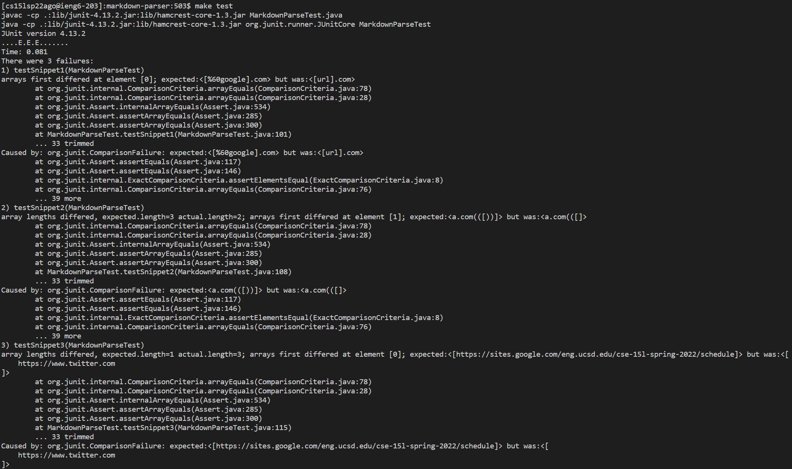

# Week 4 Lab Report

### Tyler Lee
### A16976522

## My Code
[Link to my Repository](https://github.com/dfigueroag/markdown-parser)
(note that this repository isn't owned by me but it is a group member's repository that I worked with in lab)

Here is the implementation of the tests that I added.

Here is the output after running my tests. All three tests failed.

## Questions
### Snippet 1

### Snippet 2

### Snippet 3

## Their Implementation
[Link to their Repository](https://github.com/astoriama/markdown-parser)

## Questions
### Snippet 1

### Snippet 2

### Snippet 3
