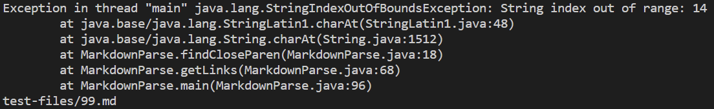
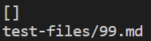
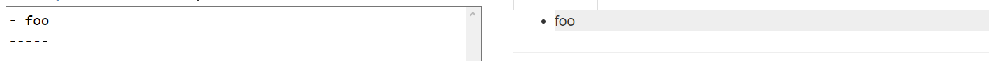
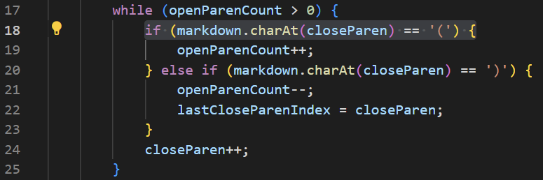
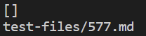
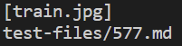
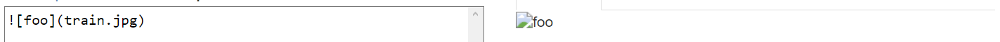
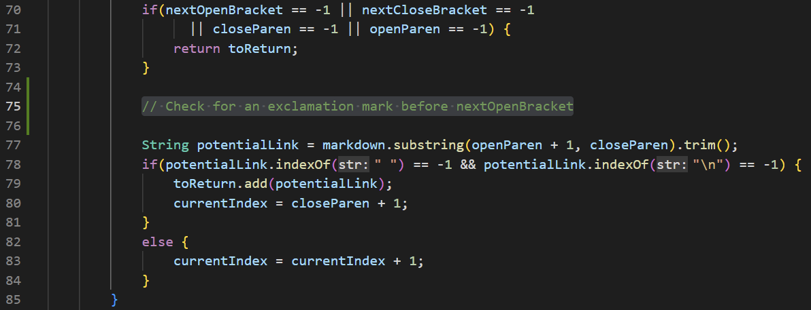

# Week 4 Lab Report

### Tyler Lee
### A16976522

## Finding Tests
In order to find the different tests, I copied the `test-file` folder into my personal `markdown-parser` as well as the `script.sh` file and ran `time bash script.sh`. Then, I manually compared the two outputs and selected two different tests that had different outputs. I could have used `vimdiff` but I decided not to because I didn't want to create a separate text file to store the output of the bash command.

Note: I moved copies of the two test files in question to my own personal repository because these specific files were truncated in the other repositories.

## Test 99
[Link to Test 99](https://github.com/tcl002/cse15l-lab-reports/blob/main/99.md)

### My Code Output

### Given Code Output

### Expected Output

### Errors

For test file 99, my personal code ran into an error which is obviously wrong. The given code ran and returned an empty array list which should be expected and I believe that this is the correct output. When you compare it with the expected output image, there is no link and therefore the given code is the correct output for the test.

### Debugging

The issue with my code is that it the variable `closeParen` reaches the end of the string before the variable `openParenCount` reaches zero. This causes the index out of bounds error. My idea of fixing this would be to also check if `closeParen >= markdown.length()` inside the `if` statement at line 18.

## Test 577
[Link to Test 577](https://github.com/tcl002/cse15l-lab-reports/blob/main/577.md)

### My Code Output

### Given Code Output

### Expected

### Errors

For test file 577, my code returns an empty array list. The given code returned an array list with 1 element containing `train.jpg`. I believe my code is correct in this case because the "link" in question is an image. In the expected output, there is no link given as it is supposed to be an image and, therefore, my code is correct for this test.

### Debugging

The issue with the given code is that it never checks if there is an exclamation mark before the link given link format. This causes the output to believe there is a link when it should be an image instead. I believe the way to fix this is to add a simple `if` statement that checks if there is an exclamation mark before the first open bracket.
